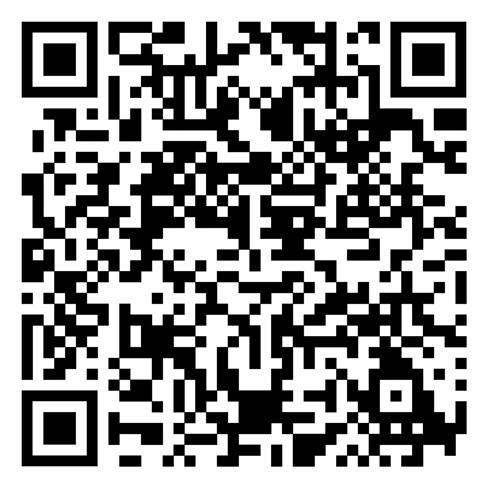

# ☕ REVO — Интернет-магазин кофе

  
  

---

## 📖 О проекте

Добро пожаловать в репозиторий **REVO**! Это современный интернет-магазин, созданный специально для ценителей качественного кофе. Проект представляет собой полноценное веб-приложение с интуитивным интерфейсом и эстетикой кофейного бренда.

### Основные возможности:

- 🛒 Удобный каталог продукции.
- 📱 Адаптивный дизайн под мобильные устройства.
- ⚡ Высокая скорость загрузки.

---

## 🛠 Технологический стек

Для реализации проекта были выбраны следующие инструменты:

| Технология                                                                                               | Назначение                          |
| :------------------------------------------------------------------------------------------------------- | :---------------------------------- |
|                 | Семантическая структура страниц     |
|                    | Стилизация, анимации и верстка      |
|  | Интерактивность и логика интерфейса |

---

## 🚀 Ссылки и доступ

Вы можете просмотреть проект вживую по ссылке ниже:

🔗 **[Открыть сайт на GitHub Pages](https://selimov01.github.io/WebApplication/src)**

### QR-код для быстрого доступа

Отсканируйте код камерой вашего смартфона, чтобы мгновенно перейти на сайт:

---

## 📂 Структура репозитория

- `src/` — Исходный код приложения.
- `assets/img/` — Графические ресурсы и медиа-файлы.
